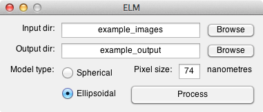
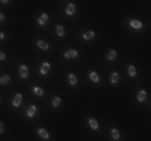
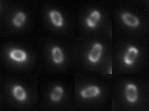
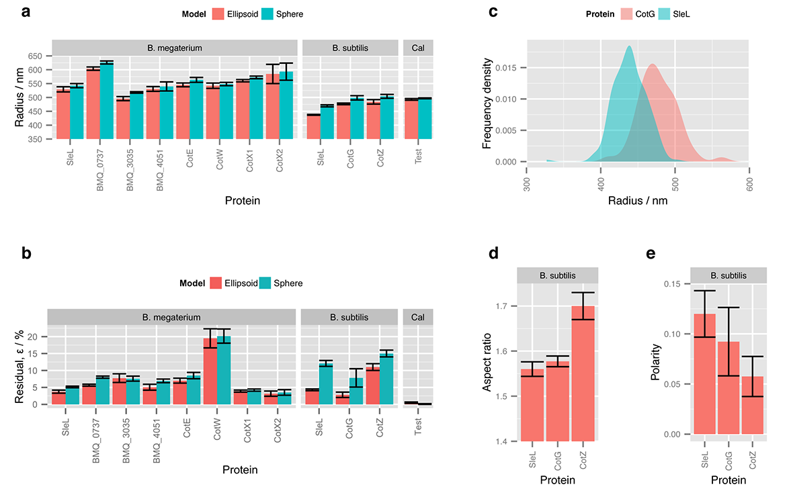

# Ellipsoid localisation microscopy software

MATLAB software for ellipsoid localisation microscopy, as used in:

[Julia Manetsberger, James D. Manton, Miklos J. Erdelyi, Henry Lin, David Rees, Graham Christie, Eric J. Rees. _Ellipsoid localisation microscopy infers the size and order of protein layers in Bacillus spore coats_. Biophysical Journal (2015).](http://dx.doi.org/10.1016/j.bpj.2015.09.023)

### Graphical User Interface

### Preparing images for analysis
For the best quantitative results, it is important to average over as many single spores as possible.
However, if spores are too close together within a field of view then the model fit quality will be reduced (in particular, clumps of spores cannot be successfully analysed).
In addition, the brighter the fluorescence, the better the fit quality, but even dim images can be analysed successfully.
While we have had some success analysing spores still within their mother cell, it is much better to analyse free spores, if possible.
The image below is an example of a 'good' image for ELM analysis, with sufficient brightness and a high, but not too high, density.

We find that 1 µl of spores in solution, pipetted onto a slide and covered with a polylyseine cover slip works well for imaging, with the polylyseine ensuring that the spores stick to the cover slip and do not drift around in solution.
As the fluorescence from a coat protein layer is quite weak, we find it advantageous to focus the spores using phase contrast imaging to reduce photobleaching.

### Example output

The animation below shows the output from running the ELM software on one image.
First, each spore is detected and segmented, with each segment being tiled for display in the first frame of the animation.
The second frame shows the model fit for each spore, with the final frame demonstrating a super-resolved reconstruction, where the parameters from the model fit are fed back into the image generation pipeline, but without the effect of microscope blurring.

In addition to these images, all parameters for the model fit for each spore, along with the residual sum of squares error, is saved to a MATLAB array for quantitative analysis (see example below).

