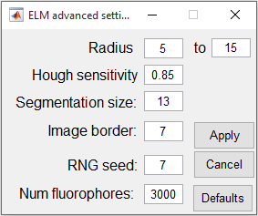

# Ellipsoid localisation microscopy software

MATLAB software for ellipsoid localisation microscopy (ELM).

Eric J. Rees and James D. Manton, University of Cambridge. 2016. License: CC-BY 4.0.

The principle of ellipsoid localisation microscopy is presented in the following paper, together with measurements of some coat protein positions in *B. megaterium* and *B. subtilis*:

[Julia Manetsberger, James D. Manton, Miklos J. Erdelyi, Henry Lin, David Rees, Graham Christie, Eric J. Rees. _Ellipsoid localisation microscopy infers the size and order of protein layers in Bacillus spore coats_. Biophysical Journal (2015).](http://dx.doi.org/10.1016/j.bpj.2015.09.023)

This software package is a more advanced version of the method used above, and will be presented in more technical detail in an upcoming paper. Please cite these papers if you use this software for a publication.

>- The fluorescent shell analysis repository also includes some preliminary code for a similar analysis of cylindrical fluorescent shells

## 1. Background
ELM is an image analysis tool designed to estimate the location of fluorescent fusion proteins in bacteria coats.
Analogous fluorescent shell structures (where 'shell' just means a thin fluorescent layer around a spheroidal specimen) can also be measured.

ELM very precisely infers the size (i.e. radius, or axis lengths) of fluorescent shell structures with certain geometries (e.g. spherical, ellipsoidal), by analysing fluorescence image data which can be captured on a traditional fluorescence microscope.
The model structures provide good approximations of the way that some GFP-fusion proteins are incorporated into the multi-layered coats of bacterial spores.
The ELM  method consists of segmentation of individual spore images (which must be well-separated from each other) followed by fitting an equation or a model to each image of a spore.
For spherical shells, the radius can be inferred with a precision better than about 10 nm, and for ellipsoidal shells the semiaxis lengths can be inferred with similar precision.
(The precision depends on the brightness and uniformity of the shells.)
This makes it possible to identify information such as the position of each protein in a multi-layered coat, with a precision much better than the diffraction-limited resolution of an optical microscope.


## 2. Graphical User Interface


## 3. Preparing images for analysis
For the best quantitative results, fluorescence microscopy should be performed to try and get images with the following qualities:
* __Separate spores.__ Well-separated images of individual spores. (Sparse spore images allow easy segmentation, and prevent the image-fitting from being spoiled by overlapping structures.)
* __Lots of spores.__ Having lots of spore images (say 1000), provided they are well-separated, will provide a more robust average measurement of a protein layer position.
* __In focus.__ Spores should be in-focus (e.g. the fluorescent coat should look as sharp as possible). They are assumed to all lie in the focal plane.
* __A dark background.__
* __Bright spore coats.__ The brighter the fluorescence of the spore coat protein, the better the fit quality, but even dim images have been analysed successfully.
* __Not saturated.__ The digital image should not be saturated. The pixel values in the digital image are assumed to be linearly proportional to the optical image brightness.
* __Known scale.__ The width of the digital pixels needs to be known. We use a 100X objective lens with a Retiga 2000R camera, which gives a pixel width corresponding to 74 nm on the specimen. This is a good pixel size to use, because the 'ring-shaped' image of fluorescent shells can be resolved, and this is the structure that is analysed to infer the fluorescent shell size.

The image below is an example of a 'good' image for ELM analysis, with sufficient brightness and a high, but not too high, density.


**Slide preparation method 1**

We find that 1 µl of *B. megaterium* or *B. subtilis* spores in suspension (sterile water), pipetted onto a slide and covered with a polylyseine cover slip works well for imaging, with the polylyseine ensuring that the spores stick to the cover slip and do not drift around in solution.
As the fluorescence from a coat protein layer can be quite weak, we find it advantageous to focus the spores using phase contrast imaging and then briefly illuminate the spores for fluorescence imaging. This helps to minimise photobleaching.

**Slide preparation method 2**

We have also found that a dab of *B. subtilis* spores (approximately 1 cubic mm) can be taken directly from a petri dish if they have been prepared on agar, and placed on a microscope slide. Then three microliters of sterile water should be pipetted onto the dab, and the mixture should be pipetted up and down several times to disperse the spores. Firmly pressing a coverslip down onto the sample can be sufficient to immobilise these spores for imaging (although method 1 may work better).

## 4. Example results

The animation below shows the output from running the ELM software on one image.
First, each spore is detected and segmented, with each segment being tiled for display in the first frame of the animation.
The second frame shows the model fit for each spore, with the final frame demonstrating a super-resolved reconstruction, where the parameters from the model fit are fed back into the image generation pipeline, but without the effect of microscope blurring.


In addition to these images, all parameters for the model fit for each spore, along with the residual sum of squares error, are saved to a MATLAB array for quantitative analysis. These numerical results can be used to plot graphs such as these:


## 5. How to use this ELM software
__Download and start__
 1. Download the entire ELM folder from its github repository: https://github.com/quantitativeimaging/ELM .
 2. Start Matlab. (Version 2016a was used for development. It may work with older versions.). Set the ELM folder as the working folder.
 3. Run the file ```ELM.m``` or start it from the console with the command ```>>ELM```. This will start the graphical user interface (GUI).

__Process a folder of images__

The ELM GUI will try to analyse every file in a selected folder. It will save its results (images and ```.CSV``` files of numerical data that can be opened by excel) into a selected output folder.

 1. Prepare a folder containing only the images to be analysed. TIF files are the intended format for input, but other image formats may work. The GUI will start with a folder of sample data selected: this folder contains a small TIF image of some approximately-spherical _B. megaterium_ spores. There is also a folder containing a sample image of appproximately-ellipsoidal _B. subtilis_ spores, but try processing the _B. megaterium_ images first.
 2. In the ```Input``` field, enter the location of a folder of images that you want to process. You can use the ```Browse``` button to select a folder. (Note that you are selecting a folder, not a single file.)
 3. In the ```Output``` field, select a folder where you want to save the results. You can leave this as the default ```example_output/``` folder if you want.
 4. Enter the width of the pixels on the microscopy sample. It is 74 nm in the sample data. The ELM software should work OK if spore coats (radius ~ 500 nm) are imaged with a pixel width in about the range 50 nm to 100 nm, but this has not been explored much by the authors.
 5. If the spores are approximately spherical, select the ```Spherical``` model button. If they are approximately ellipsoidal, select the ```Ellipsoidal``` model button.
 >- the cylindrical model is implemented in the fluorescent shell analysis repository. It will be incorporated into the ELM GUI in a slightly different way, and should not be selected in the current version.

 6. Click the ```Process``` button. The software will then try to process all the image data and save the results.
  * This should take a few seconds for the spherical model with its sample data, or a few minutes for the ellipsoidal model with its sample data. The waitbar will update every time the program moves on to a new file.
  * Large folders of ellipsoidal spore images are best processed overnight.

 7. For each input file, the GUI will save four images to the output folder, as well as an (excel-readable) ```.CSV``` file with numerical results, and a ```.MAT``` file of Matlab-readable results. These output files will start with the same name as the corresponding input file.

## 6. How to read and interpret the numerical results of the ELM software

The ELM software saves both a spreadsheet (```filename_params.CSV```) and a Matlab file (```filename_params.mat```) for each input file (```filename.tif```).
It also saves several image file showing the raw, segmented, fitted, and reconstructed images for each input file.

### CSV (spreadheet) data
The simplest way to review the numerical results is to open the ```.CSV``` results file in Excel or some other spreadsheet.
The top row of the spreadsheet gives the parameter names saved by the ELM software, and each row of numberical data underneath gives the inferred values for one candidate spore.

### The saved parameters are as follows

Columns 1 and 2.
```x segment pos``` and	   ```y segment pos``` are the rough XY-coordinates of the spore centre, estimated by the segmentation step of the image analysis. Units are pixel widths.

Columns 3 and 4.
```x shift``` and ```y shift``` are the XY-offsets to the exact centre position of the spore, obtained by the fitting step of the image analysis. Units are pixel widths.

Column 5.
```orientation``` is the azimuth orientation inferred by the ellipsoidal model for a prolate ellipsoid of revolution with its long axis lying in the XY plane. It is zero by default for a sphere.

Column 6.
```semiminor axis``` is the radius of a spherical shell, or the semi-minor axis of an ellipsoidal shell. Units are pixel widths.

Column  7.
```PSF variance``` describes the size of the point spread function (blur radius of the model microscope) fitted to the image data. Units are (pixel widths) squared.

Column 8.
``` brightness``` describes the fluorescence brightness of the spore. It is useful for comparing different spores.

Column 9.
```aspectRatioMinusOne``` is needed to handle ellipsoidal spores. If the long semiaxis length is ```b``` and the short semiaxis length is ```a``` then the parameter records ```(b/a) - 1```.  A value of zero is recorded for a sphere, naturally.

Column 10.
```equatorialty``` allows for ellipsoidal spores to have non-uniform fluorescence brightness per unit of their surface area, and to be brighter at the poles (if negative) or equator (if positive). The name 'polarity' was avoided in the programming, as that name may have various biological meanings.

Column 11.
``` residual``` is the sum of squared differences between the fitted pixel values and the actual values in the image data. (Actual values are after uniform background subtraction, and fitted values are fitted to the background-subtracted data.)

Column 12.
```sum_square_signal``` is the sum of squared pixel values (brightnesses) in the image data, after uniform background subtration.

Note the ```radius``` and ```semiminor_axis```lengths are given in pixel widths, and need to be multiplied through by the pixel width to give physical distances.


### MAT file data for Matlab

To read the data in Matlab, drop the ```.mat``` file onto the Matlab console.
The same data as in the spreadsheet is saved with the header names in the string ```fitsHdr``` and the numerical parameters for each spore stored as rows in ```fitData```.

The Matlab script ```\rough\analyse_results.m``` reads all the ```MAT``` files in an output folder and can provide a summary of the combined results of all the spores in each image. (Refer to that script for details.)
It can also perform a quality control step to exclude bad fits (usually by removing fits with extreme shell radii, or large blur radii) before summarising the accepted results.

The image analysis results are also saved as a cell array in the ```MAT``` file, which can be read as follows (although EJR recommends avoiding cell arrays if possible):

    fit_headers = fits{1}   % Reads the headings of the data columns
    fit_data = cell2mat(fits(2:end)) % Reads the data

    % Evaluate mean equivalent sphere radius of ellipsoids:
    equivalent_radius = mean(fit_data(:,6).*(1+fit_data(:,9)).^(1/3))*74


## 7. Notes

The ```Advanced``` button opens a panel in which some image analysis settings can be adjusted. This may be necessary for images with somewhat different scale or brightness to the sample data.  


* The image segmentation step may miss a few spore images. The sensitivity parameter can be adjusted (increased) to capture more candidates, but this might introduce false positive candidates.
* The image segmentation step uses ```imfindcircles``` which often returns a warning (that the function is looking for small circles). With the sample data, this warning is over-cautious and can be ignored.
